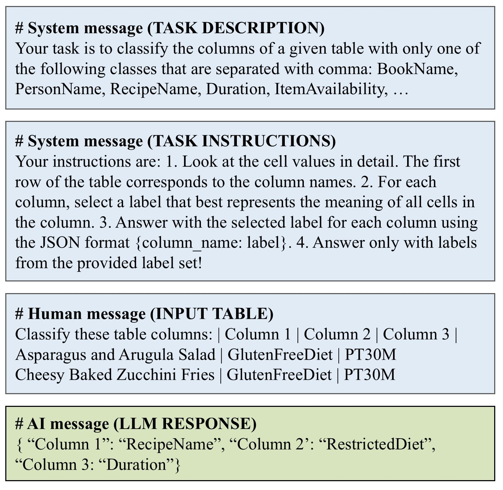

# Evaluating Knowledge Generation and Self-Refinement Strategies for LLM-based Column Type Annotation
This folder contains the code to reproduce the experiments in the paper <b>"Knowledge Generation and Self-refinement strategies for LLM-based CTA"</b>.

## Environement Setup

The packages required for running our code can be found in the `cta-self-ref.yml` file. To build the enviroment, after cloning this repository, navigate to the folder containing the yml file and run the following command:

 `conda env create -f cta-self-ref.yml`

## Data
We use three datasets in our experiments: a subset of <a href="https://webdatacommons.org/structureddata/sotab/v2/">SOTAB V2 CTA</a>, a subset of the <a href="https://github.com/sunlab-osu/TURL">WikiTables-TURL CTA</a> dataset, and the <a href="https://github.com/alan-turing-institute/SemAIDA/tree/master/IJCAI19/SemColHNN_Codes/Limaye">Limaye</a> dataset. The training, validation, and test splits used in our paper can be found in the `data` directory in pkl format to be used directly in the notebooks and python scripts, while in the directory `data/sets/` the datasets are provided in csv format.

The terms to be used for the annotation of each dataset can be found in the respective "labels" folder in the "data" directory. For example, the terms for the WikiTables-TURL dataset are found in the folder `data/wikitables-2-labels/wikitables-2_all_labels.txt`.

### Table Representation
</img>

Within the prompts used in the paper (an example of a zero-shot prompt shown above), the tables are represented in a markdown format and only the five first rows of a table are shown. To change this representation, the respective `build-sets` files for each dataset in the `preprocess-data` directory can be updated.

## Baselines
To run the baselines for the <b>OpenAI</b> models, the `GPT-baseline.py` file can be used. The <i>datasets</i> parameter can be changed to the dataset(s) being tested and the number of demonstrations selected for the prompts can be set to 0 or 5.

To run the baselines for the <b>open-source Llama</b> models, the <a href="https://github.com/wbsg-uni-mannheim/TabAnnGPT/blob/main/KnowledgeSelfRefinementForCTA/eval_scripts/run-llama-baselines.sh">`eval_scripts/run-llama-baselines.sh`</a> file can be used. In this file, the `--model_id` parameter is used to select the open-source model to use, the `--dataset` parameter can set the dataset tested and the `--shot` parameter can be used to set the number of demonstrations to inlcude in the prompts (0 or 5).

To run self-consistency experiments for the OpenAI models, first run the `GPT-baseline.py` file and vary the `temperature` variable (in the paper we use temperature 0, 0.5 and 0.7). Afterwards, run the `self_consistency.py` file to get the self consistency results. For the open-source models, run the `eval_scripts/run-llama-self-consistency.sh` script and the `self_consistency.py` file.

## Knowledge Generation Prompting

The following steps must followed to generate the <i>initial</i>, <i>demonstration</i> and <i>comparative</i> definitions:

1. <b>Generate the label definitions</b>: The <a href="https://github.com/wbsg-uni-mannheim/TabAnnGPT/blob/main/KnowledgeSelfRefinementForCTA/generate_definitions.py">`generate_definitions.py`</a> file is used to generate the <i>initial</i> and <i>demonstration</i> definitions, while the <a href="https://github.com/wbsg-uni-mannheim/TabAnnGPT/blob/main/KnowledgeSelfRefinementForCTA/generate_compatative_definitions.py">`generate_comparative_definitions.py`</a> file can be used to generate <i>comparative</i> definitions.
2. <b>Create embeddings</b> for the train, validation and test set using the <a href="https://github.com/wbsg-uni-mannheim/TabAnnGPT/blob/main/KnowledgeSelfRefinementForCTA/preprocess-data/embed_datasets.py">`preprocess-data/embed_datasets.py`</a> file.
3. <b>Knowledge Promting</b>: To use the definitions in knowledge prompting, the `GPT-definitions.py` file can be used for testing OpenAI models and <a href="https://github.com/wbsg-uni-mannheim/TabAnnGPT/blob/main/KnowledgeSelfRefinementForCTA/eval_scripts/run-llama-knowledge-prompting.sh.sh">`eval_scripts/run-llama-knowledge-prompting.sh`</a> for open-sourced models.

### Generated definitions
We provide the generated definitions in the respective labels folder of each dataset in the `data` directory. Initial and demonstration definitions file names follow the following pattern:

`[dataset_name]-[model_name]_[initial/demonstration]_definitions.json`

The model_name in the pattern is the name of the model used to generate the definitions. For our non-fine-tuning experiments, the model used to generate the definitions is always the model gpt-4o-2024-05-13.

## Error-based Self-refinement

To self-refine the <i>demonstration</i> definitions, these steps should be followed:

1. Run classification of the validation set using knowledge prompting with demonstration definitions: Run the file `GPT-definitions.py`, by setting the datasets parameter to the needed dataset(s), specifying which definitions to use, in this case the <i>-gpt-4o-2024-05-13_demonstration</i> definitions and the parameter `run_val` set to True.
2. Refine the demonstration definitions by using the `self_refine_definitions.py` file. In this file, the model whose errors are used to update the definitions should be specified in the `model` parameter.

### Refined definitions
The refined definitions used in our paper are made available in the labels folder in the `data` directory of the respecitive dataset. The definition file names follow the following pattern: 

`[dataset_name]-[previous_definitions_name]-[model_name]_refined_definitions.json`

In this case, model_name specifies the name of the model whose errors were used for refining the definitions. The previous_definitions_name is set to "-gpt-4o-2024-05-13_demonstration" as in our paper we refined the <i>demonstration</i> definitions.

## Fine-tuning the Open-source Models
To create the four fine-tuning sets described in the paper (simple set, fine-tuning with definitions, multi-task set and multi-task-3 set) for the fine-tuning Llama experiments, the <a href="https://github.com/wbsg-uni-mannheim/TabAnnGPT/blob/main/KnowledgeSelfRefinementForCTA/preprocess-data/create-ft-sets.py">`preprocess-data/create-ft-sets.py`</a> script can be used. To create the data for fine-tuning OpenAI models, the <a >`preprocess-data/create-openai-ft-sets.py`</a> is used.

To fine-tune the open-source models use the <a href="">`ft_scripts/run-fine-tuning.sh`</a>. Using the `--model_id` parameter the model to fine-tune can be set, with the `--set` parameter the dataset can be chosen, with the `--subset` one of the four fine-tuning sets can be chosen. Other parameters can also be used to set the batch size, learning rate and epochs parameters for the fine-tuning process.

To test the fine-tuned models, use the <a href="">`eval_scripts/run-fine-tuned-model-testing.sh`</a> script. In this script, the model_id parameter should point to the folder where the fine-tuned model was saved.

## Self-correction
To use the self-correction pipeline, the following steps should be followed:

1. Run one-step CTA using zero or knowledge prompting with demonstration and comparative definitions with `GPT-baselines.py`/<a href="https://github.com/wbsg-uni-mannheim/TabAnnGPT/blob/main/KnowledgeSelfRefinementForCTA/eval_scripts/run-llama-baselines.sh">`eval_scripts/run-llama-baselines.sh`</a> or `GPT-definitions.py`/<a href="https://github.com/wbsg-uni-mannheim/TabAnnGPT/blob/main/KnowledgeSelfRefinementForCTA/eval_scripts/run-llama-knowledge-prompting.sh.sh">`eval_scripts/run-llama-knowledge-prompting.sh`</a> respectively. (If these files have already been run for the above strategies, there is no need to re-run them.)
2. To initialize a reviewer model for correcting the classification in the first step, run `GPT-reviewer.py`/<a href="https://github.com/wbsg-uni-mannheim/TabAnnGPT/blob/main/KnowledgeSelfRefinementForCTA/eval_scripts/run-llama-reviewer.sh">`eval_scripts/run-llama-reviewer.sh`</a>.

## Model Predictions, Prompts, Errors, and Evaluation Files
In order to allow a deeper analysis of the results, we provide the complete output of running the experiments for download. The predictions, evaluation, errors per labels, and messages (prompts) are organized under the respective model and dataset name in the `output` directory in three folders: predictions, evaluation and messages. For example, to check the predictions of the <i>gpt-4o-mini</i> model, the file can be found in the directory `output/sotabv2-subsetu/gpt-4o-mini/predictions/`. The error files are contained in the evaluation folders. Some prompt examples are included in the `imgs` directory.
